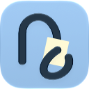
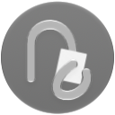
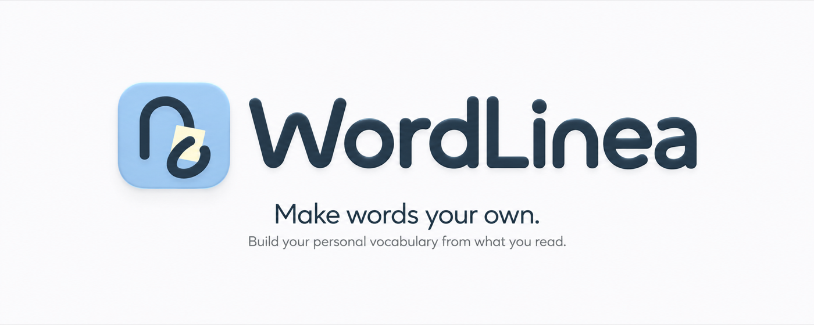

# WordLinea brand assets

The WordLinea identity pairs a continuous rounded line with a thin yellow sheet of paper. The icon uses shallow highlights and shadows, with fine fibers in the paper. The rounded, upright WordLinea wordmark appears in the promotional compositions.

[Download the complete kit](https://github.com/WordLinea/.github/raw/refs/heads/main/wordlinea-brand-kit.zip) · [Website](https://wordlinea.com) · [Support](https://wordlinea.com/support)

## Logos

Every appearance and shape is available at **32, 64, 128, 256, 512, and 1024 px**. PNG exports preserve transparency around the enclosure. Use 512 px for profile pictures and 1024 px as the raster master for larger placements.

| Appearance | Square | Circle |
| --- | --- | --- |
| Default |  |  |
| Dark |  |  |
| Monochrome |  |  |

### Master downloads

| Appearance | Square · 512 px | Square · 1024 px | Circle · 512 px | Circle · 1024 px |
| --- | --- | --- | --- | --- |
| Default | [PNG](logos/wordlinea-default-square-512.png) | [PNG](logos/wordlinea-default-square-1024.png) | [PNG](logos/wordlinea-default-circle-512.png) | [PNG](logos/wordlinea-default-circle-1024.png) |
| Dark | [PNG](logos/wordlinea-dark-square-512.png) | [PNG](logos/wordlinea-dark-square-1024.png) | [PNG](logos/wordlinea-dark-circle-512.png) | [PNG](logos/wordlinea-dark-circle-1024.png) |
| Monochrome | [PNG](logos/wordlinea-mono-square-512.png) | [PNG](logos/wordlinea-mono-square-1024.png) | [PNG](logos/wordlinea-mono-circle-512.png) | [PNG](logos/wordlinea-mono-circle-1024.png) |

[Browse all 36 logo sizes](logos/)

## Banners and sharing images

| Asset | Size | Use |
| --- | --- | --- |
| [Brand banner](banners/wordlinea-banner-1400x560.png) | 1400 × 560 PNG | Organization profile, README header, wide promotional placement |
| [Compact tile](banners/wordlinea-tile-440x280.png) | 440 × 280 PNG | Compact promotional cards |
| [English sharing image](social/wordlinea-en-1200x630.jpg) | 1200 × 630 JPEG | English link previews |

## Color

| Color | Hex | Role |
| --- | --- | --- |
| Ink blue | `#20384A` | Line, lettering, dark appearance background |
| Blue | `#8CC0EB` | Default icon background and light accents |
| Paper yellow | `#FFF9D2` | Paper sheet |

## Using the assets

- Keep the icon, wordmark, and compositions proportional. Choose the circle export for circular placements.
- Preserve the line, paper overlap, paper texture, and short shadows.
- Use the supplied dark appearance on dark surfaces and the default appearance on light surfaces.
- Keep the full lettering and leave clear space around the brand. Place functional text outside the artwork.
- The wordmark is artwork embedded in the supplied compositions, not a downloadable typeface.

The logos are exports of the approved Apple Icon Composer artwork. Promotional images use the approved rounded wordmark and icon direction. All files in this kit retain the approved export pixels and dimensions.

For another format or a brand-use question, contact [support@wordlinea.com](mailto:support@wordlinea.com).
